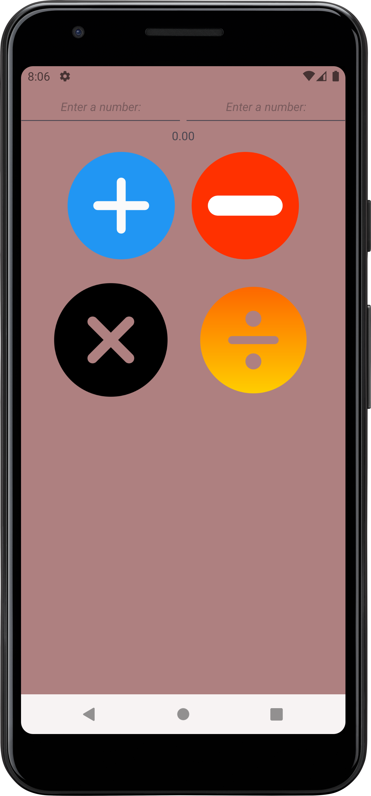

# Calculator App

Welcome to the Calculator App! This simple yet elegant calculator is designed for Android, providing essential arithmetic operations with a user-friendly interface. Whether you need to add, subtract, multiply, or divide, our app ensures accurate calculations with intuitive input handling.

## Features

- **Basic Arithmetic Operations**: Perform addition, subtraction, multiplication, and division with ease.
- **User-friendly Interface**: Clean and elegant design for a seamless user experience.
- **Error Handling**: Provides real-time feedback for invalid inputs and division by zero.

## Screenshots



## Installation

To install the Calculator App on your Android device, follow these steps:

1. Clone the repository:
   ```bash
   git clone https://github.com/yourusername/calculator-app.git
   ```